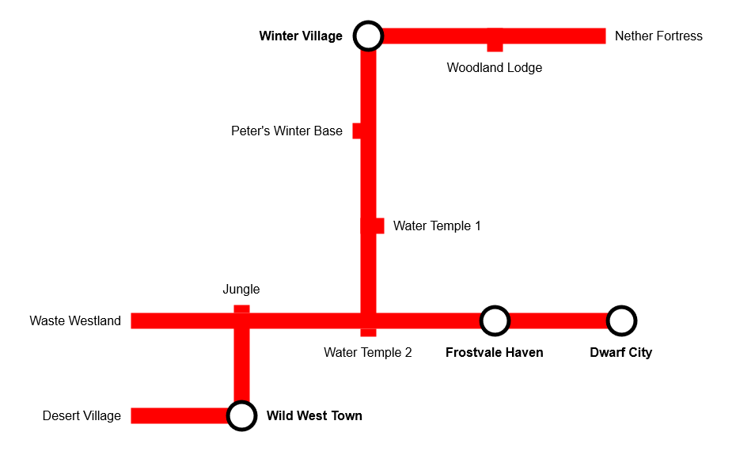

# hom-mc-server

SCM controlled configuration for the Heroes of Mirren Minecraft Server.

* [Locations](#locations)
* [Nether Road Map](#nether-road-map)
* [Run Locally](#run-locally)
* [Run in Docker](#run-in-docker)
* [Automation & Backup](#automation--backup)

## Locations

The table below shows the locations of known settlements and points of interest.

### Settlements

<table>
  <tr>
    <td><b>Map</b></td>
    <td><b>Name</b></td>
    <td><b>Coordinates</b></td>
    <td><b>Nether Road</b></td>
  </tr>
  <tr>
    <td></img></td>
    <td>Winter Village</td>
    <td><code>14 69 -10</code></td>
    <td>Yes</td>
  </tr>
  <tr>
    <td></img></td>
    <td>Wild West Town</td>
    <td><code>0 64 5852</code></td>
    <td>Yes</td>
  </tr>
  <tr>
    <td></img></td>
    <td>Dwarf City</td>
    <td><code>11281 8 2102</code></td>
    <td>Yes</td>
  </tr>
  <tr>
    <td></img></td>
    <td>Frostvale Haven</td>
    <td><code>1766 131 2508</code></td>
    <td>Yes</td>
  </tr>
</table>

### Other POI

<table>
  <tr>
    <td><b>Name</b></td>
    <td><b>Coordinates</b></td>
    <td><b>Nether Road</b></td>
  </tr>
  <tr>
    <td>Desert village</td>
    <td><code>-372 69 5911</code></td>
    <td>Yes</td>
  </tr>
  <tr>
    <td>Water temple 1</td>
    <td><code>-114 68 1261</code></td>
    <td>Yes</td>
  </tr>
  <tr>
    <td>Water temple 2</td>
    <td><code>-194 63 1721</code></td>
    <td>Yes</td>
  </tr>
  <tr>
    <td>Woodland Lodge</td>
    <td><code>-12191 67 4405</code></td>
    <td>Yes</td>
  </tr>
  <tr>
    <td>Jungle</td>
    <td><code>-7627 64 4035</code></td>
    <td>Yes</td>
  </tr>
  <tr>
    <td>Waste Westland</td>
    <td><code>-786 73 6167</code></td>
    <td>Yes</td>
  </tr>
</table>

## Nether Road Map

</img>

## Run Locally

Install Java JDK:

```
sudo apt install openjdk-17-jre -y 
```

Put any existing world files in `world`, then launch:

> Use `scripts/fetch-latest-world.sh` to download the latest backup from S3.

```
./scripts/start.sh
```

> Note: All `.jar` files must be at same level as `world`.

Configuration is stored in `server.properties`.

## Run in Docker

The `scripts/start-docker.sh` script builds and runs the container all in one.

Alternatively, Install Docker:

```
curl -sSL https://get.docker.com | sh
```

Add user to Docker group:
```
sudo usermod -aG docker $USER
logout
```

Build the image:

```
docker build -t hom-mc-server .
```

Then run a container with exposed port and mounted world directory:

```shell
# Create if no existing world
mkdir -p world

docker run --rm -p 25565:25565 -v ./world:/server/world -t hom-mc-server
```

## Automation & Backup

Local and remote backup is automated with a connected USB drive and/or AWS S3.

See `scripts/crontab.txt` for template crontab to automate these.

### Local backup

Backup the server locally to `/mnt/usb/backup`:

`./scripts/local-backup.sh`

### AWS S3 backup

Backup the server to an AWS S3 bucket as a `zip` archive:

`./scripts/upload-backup.sh`
